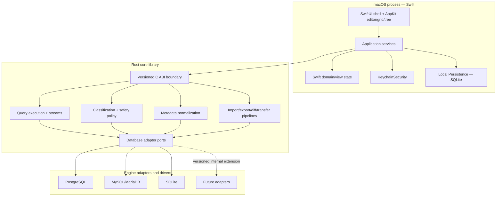
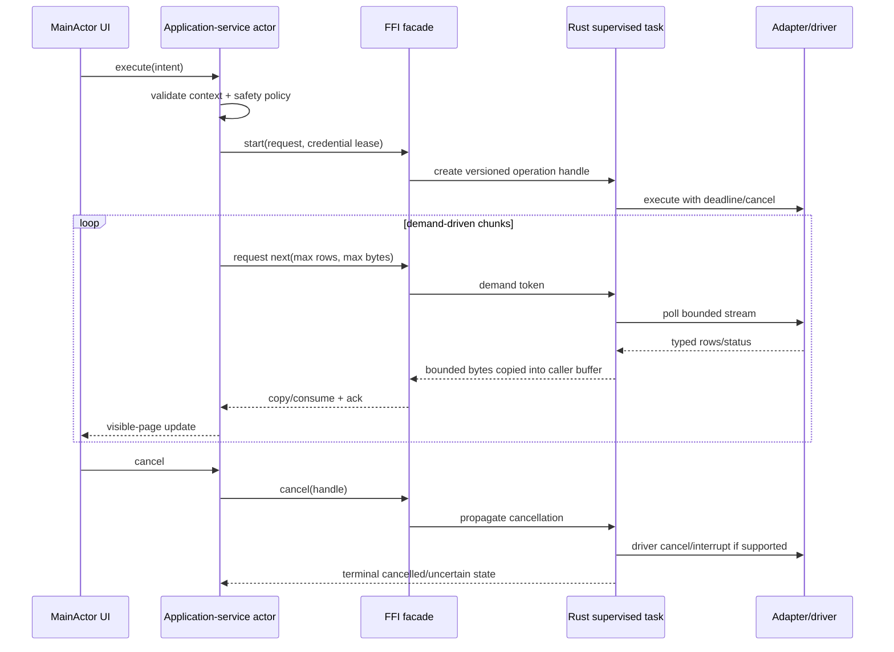

# DataForge Architecture

Status: Proposed planning baseline

Last reviewed: 2026-07-29

Decision authority: accepted ADRs in [`docs/adr`](adr/README.md)

## 1. Scope and quality attributes

This document defines the target architecture for an independent native macOS database client. It is a plan, not authorization to write production code. The architecture optimizes, in order, for data safety, credential security, correctness, testability, bounded resource use, native macOS behavior, maintainability, and delivery scope.

The first complete product slice is PostgreSQL. MySQL, MariaDB, and SQLite follow only after the adapter contract survives that slice. Redis and MongoDB must use model-appropriate experiences rather than being forced through relational assumptions.

Key quality attributes are:

- no secret persistence outside macOS Keychain;
- no database or file I/O on the main thread;
- no unbounded result, queue, cache, object tree, task set, or retry loop;
- explicit connection, environment, transaction, timeout, row limit, cancellation, streaming, and logging context for every execution;
- capability-driven UI and engine behavior;
- deterministic, previewable SQL generation with dialect tests;
- explicit ownership and lifecycle across the Swift/Rust boundary;
- fail-closed TLS and SSH trust;
- original product identity and native interaction design.

## 2. Architectural style

DataForge uses a **feature-modular hexagonal architecture**. Feature modules own user-facing use cases; application services orchestrate domain ports; infrastructure implements ports; database-specific behavior stays in adapters. This combines the practical ownership of feature modules with the dependency direction of hexagonal architecture.

| Style considered | Strength | Limitation for DataForge | Decision |
| --- | --- | --- | --- |
| Modular Clean Architecture | Strong dependency direction and use-case isolation | Layer-first packaging can scatter one feature across too many ownership units | Use its dependency rule, not layer-first repository ownership |
| Hexagonal Architecture | Explicit ports/adapters make drivers, Keychain, persistence and files replaceable/testable | Does not by itself define product-team/module ownership | Use as the dependency and infrastructure boundary |
| Feature-based modular architecture | Clear feature ownership, incremental vertical slices and smaller review scope | Can leak infrastructure/dialect logic into features without strict ports | Use for module/repository ownership, constrained by hexagonal ports |

Alternatives are therefore composed rather than treated as exclusive: feature modules above stable domain ports, with concrete database/platform adapters outside the domain. A change that bypasses this direction needs an ADR rather than an expedient import.

Dependency rules:

1. Presentation depends on application service protocols and presentation models, never a driver.
2. Application services depend on domain interfaces, not concrete infrastructure.
3. Rust domain types do not depend on a concrete driver.
4. Adapters may depend on drivers but never SwiftUI/AppKit, Keychain UI, or presentation state.
5. SQLite metadata and Keychain are separate stores with separate models; secret values never become persistent `Codable` fields.
6. Cross-feature collaboration occurs through explicit commands/events, not global mutable singletons.

## 3. Module map

| Module | Responsibility | Prohibited dependencies/behavior |
| --- | --- | --- |
| `AppShell` | App lifecycle, windows, menus, commands, restoration composition | Database calls, credentials, SQL generation |
| `Workspace` | Tabs, drafts, layouts, document identity, crash recovery | Plaintext secrets or driver models |
| `Connections` | Non-secret connection profiles, environment/read-only policy, connection use cases | Building raw connection strings in UI |
| `KeychainSecurity` | Keychain references, credential leases, access policy | `UserDefaults`, SQLite, logging secret values |
| `DatabaseCore` | Stable domain contracts shared by core operations | Concrete driver types |
| `DatabaseAdapters` | Capability declarations and engine-specific implementations | UI state/dialogs and secret logging |
| `ObjectExplorer` | Lazy object navigation and metadata presentation | Eager full-tree load |
| `QueryEditor` | Text document/editor state, parsing requests, completion UI | Query execution in `body` or dialect execution logic |
| `QueryExecution` | Execution orchestration, transaction/session state, stream lifecycle | Automatic write retry without idempotency proof |
| `ResultGrid` | Virtualization, bounded pages, selection, type-aware display | Converting all core values to strings |
| `DataEditor` | Pending changes, key identity, optimistic concurrency, preview/apply/rollback | Editing unidentifiable rows without explicit safe policy |
| `ObjectDesigner` | Validated object edit intent and generated migration preview | Auto-applying dangerous DDL |
| `SchemaDiff`, `DataDiff` | Normalize, compare, plan, preview, verify | Immediate apply after comparison |
| `DataTransfer`, `ImportExport` | Bounded streaming pipelines, resumability, reports | Untrusted path use or unbounded buffers |
| `BackupRestore` | Adapter capability and official-tool orchestration | Shell interpolation or hidden credential arguments |
| `Modeling`, `Monitoring`, `Automation` | Later milestone features | Assuming unsupported adapter capabilities |
| `Diagnostics` | Structured redacted events and previewable bundles | Row payloads, connection strings, secrets |
| `SharedUI` | Small design-system primitives only | Business rules or feature state ownership |
| `TestSupport` | Fake clocks, adapters, fixtures, disposable DB guards | Production credentials or shared staging targets |

Avoid generic `Utils` or `Helpers` modules. A shared abstraction must name a stable responsibility and owner.

## 4. Presentation architecture

### 4.1 SwiftUI and AppKit split

SwiftUI owns the application shell, settings, inspectors, navigation composition, alerts, and ordinary forms. AppKit is wrapped behind focused `NSViewRepresentable` adapters for components where desktop behavior and virtualization matter:

- SQL editor: `NSTextView` using TextKit 2 (`NSTextLayoutManager`), incremental decorations, visible-range work, standard input/key bindings, undo, find, accessibility, and crash-recovered document state.
- Object tree: `NSOutlineView` with lazy child loading, stable IDs, cancellation, and per-node refresh.
- Result grid: view-based `NSTableView` with cell reuse, a bounded page cache, server paging/streaming, and a synchronized frozen-column table when required.

M0 spikes must prove editor behavior with a large SQL fixture and grid behavior with million-row streaming plus a wide-table fixture. A custom renderer is a fallback only if `NSTableView` cannot meet the measured budget and accessibility contract.

### 4.2 State ownership

- UI-observable state and AppKit adapters are `@MainActor`.
- Application service actors own workflows and cancellation handles.
- Views issue intents; they do not execute database/network/file work.
- Long operations expose `idle/configuring/validating/running/cancelling/succeeded/failed/cancelled/partiallyApplied` states.
- Theme changes update visible presentation/configuration only. Dataset identity, selection, scroll position, cache, and pending edits are independent.

### 4.3 Workspace model

Use a document-like workspace coordinator rather than placing all state in `App`. Workspace persistence stores stable tab/document IDs, file bookmarks, non-secret connection references, layout, and draft recovery. Active transactions and live connection handles are never restored silently; restored tabs return to a disconnected state with an explanatory message.

## 5. Application and domain contracts

### 5.1 Commands and operation context

Every database operation receives an immutable context containing:

- operation and execution IDs;
- connection profile ID and adapter ID;
- database/schema context;
- environment classification and read-only state;
- transaction mode and expected transaction ID;
- timeout/deadline and row/byte limits;
- cancellation token;
- stream policy and bounded chunk/page sizes;
- logging/redaction policy;
- capability snapshot version.

Write commands additionally carry safety classification, user-reviewed preview digest, confirmation evidence, and an idempotency/retry policy. A stale preview digest invalidates confirmation.

### 5.2 Errors

Typed errors cover Configuration, Authentication, Authorization, Network, TLS, SSH, Timeout, Cancellation, Database, Query Syntax, Constraint, Transaction, File, Import, Export, Internal, and Unsupported Capability. The boundary transports stable error code/category, retryability, operation ID, adapter ID, user-safe message key, and redacted diagnostic fields. Raw stack traces, query parameters, row data, secrets, and full connection strings never cross for display.

### 5.3 Capability snapshots

Capabilities are discovered from the adapter and, where necessary, the connected server/version. The UI receives an immutable snapshot with a schema version and source. Commands repeat capability checks in the application/core layer to prevent stale UI state from bypassing safety.

## 6. Concurrency and resource model

Rules:

- one supervised Tokio runtime inside the Rust core; no unmanaged tasks;
- structured Swift concurrency with cancellation propagation; no detached work for normal operations;
- bounded channels with explicit capacity and backpressure;
- synchronous SQLite driver work on a bounded dedicated blocking lane, never the async runtime worker or main thread;
- per-connection pool maximums with idle/lifetime limits; transaction-pinned sessions are never returned early;
- caches document owner, byte/item limit, invalidation, lifetime, and actor/lock contract;
- cancellation is a state transition, not proof that a server stopped; adapters report `confirmed`, `requested`, `unsupported`, or `connectionClosed` outcomes.

## 7. Swift/Rust boundary

ADR-0003 chooses a versioned C ABI with generated headers and a hand-written Swift facade.

Boundary contract:

- opaque `uint64_t` handles, never Rust/Swift object pointers or borrowed references;
- fixed-width integers, tagged enums, length-delimited byte slices, and small plain records;
- caller/callee ownership documented per function; explicit `release` is idempotent and tested;
- no large result set in one call; Swift supplies a bounded destination buffer,
  pulls one chunk and acknowledges the logical demand token (Rust retains no
  caller pointer after return; see ADR-0008);
- every long operation has cancel and terminal-status functions;
- `catch_unwind` at each exported entry point prevents panic crossing FFI;
- a runtime ABI version/feature handshake rejects incompatible library and binding pairs;
- Swift facade converts callbacks/polling to `AsyncSequence` while preserving demand and cancellation;
- callback delivery uses a documented serial executor and never mutates UI state off `MainActor`;
- credentials are passed only in a short-lived non-loggable lease, copied no more than required, and zeroized where practical.

UniFFI remains a considered alternative. It offers production-quality Swift bindings, but the required streaming/backpressure, deterministic cancellation, binary stability, and lifecycle surface must be proven before replacing the C ABI. Any public contract change requires a superseding ADR and integration/compatibility tests.

## 8. Persistence and secret boundary

### 8.1 Local metadata

Swift infrastructure owns an application SQLite database through a narrow persistence protocol. GRDB is the leading candidate, subject to license/security/maintenance review at adoption. Use WAL where measurement supports it, transactional versioned migrations, integrity checks, bounded history/diagnostic retention, and secure file permissions.

Permitted data includes workspace state, saved queries, snippets, UI preferences, job summaries, history subject to retention, and non-sensitive connection metadata. SQL text/history is user data and is not telemetry.

### 8.2 Credentials

Keychain Security uses Security.framework and data-protection Keychain APIs. SQLite stores only a random credential-reference ID. Secret types are non-`Codable`, avoid `CustomStringConvertible`, redact debug descriptions, and never enter `UserDefaults`, exports, logs, analytics, crash attachments, snapshots, clipboard persistence, or diagnostics.

A `CredentialLease` is acquired immediately before connection/authentication and released after the driver has established the protected session. Background helpers require a separately reviewed Keychain access group/accessibility policy; there is no silent downgrade when a secret is unavailable.

## 9. Database adapter model

The detailed contract is in [DATABASE_ADAPTERS.md](DATABASE_ADAPTERS.md) and ADR-0007. Each adapter implements:

- validation and safe connection configuration;
- capability discovery;
- typed query/result streaming;
- cancellation semantics;
- transaction/session state;
- lazy metadata introspection and lossless-to-normalized mapping;
- identifier quoting, literal encoding where unavoidable, and parameter binding;
- error mapping and redacted diagnostics;
- engine-specific DDL/backup/monitoring only when declared.

Use a driver per adapter instead of an `Any`/lowest-common-denominator driver. Initial candidates are `tokio-postgres`, `mysql_async`, and `rusqlite`; none is approved until M0 compatibility, cancellation, TLS, type-fidelity, license, advisory, Apple Silicon, binary-size, and maintenance evidence passes.

## 10. Data, style, and edit model

Core values retain normalized type, engine type descriptor, nullability, and typed payload. `notLoaded`, SQL `NULL`, empty text, empty binary, and absent optional metadata are distinct states.

Adapters map raw types to normalized groups; the theme resolver lives in presentation infrastructure. A cascade may resolve app → connection → database → grid overrides without storing appearance in secrets. Contrast validation and icon/text/tooltips supplement color. Theme invalidation targets visible cells and style caches, never query/result caches.

Editable rows require a primary or proven unique key plus original version values used for optimistic concurrency. Tables lacking safe identity are read-only by default. Apply uses a previewed parameterized statement, transaction policy, affected-row assertion, and refresh/reconciliation. Zero or multiple affected rows is a conflict/failure, never silent success.

## 11. Safety and security boundaries

Safety classification uses a real parser/tokenizer plus adapter semantics, not regex alone. UI confirmation is defense in depth; the application/core policy revalidates read-only, production, transaction, capability, and preview digest immediately before execution. See [DATABASE_SAFETY.md](DATABASE_SAFETY.md) and [SECURITY_THREAT_MODEL.md](SECURITY_THREAT_MODEL.md).

Trust boundaries include user/imported files, database servers, TLS endpoints, SSH servers/agents, native backup tools, update feeds, dependencies, future plugins, diagnostics export, and Swift/Rust FFI. All are untrusted until validated for their specific operation.

## 12. Observability

Structured events contain timestamp, severity, subsystem, operation/job/execution IDs, adapter, category, retryability, and allowlisted redacted context. Redaction happens before serialization/sink fan-out. Queries, parameters, row values, full paths when sensitive, connection strings, clipboard, credentials, keys, and tokens are denied by schema.

Diagnostics export builds an exact local preview, then atomically writes only the previewed bytes. Crash reporting and telemetry are off by default and require separate opt-ins. Local deletion is explicit and independently controls history, diagnostics, drafts, metadata, and credentials.

## 13. Extensibility and process isolation

There is no third-party plugin loading in MVP. Internal adapters use versioned capability contracts so a future plugin API is possible. A future plugin must be signed, out of process, authenticated over XPC, version negotiated, crash isolated, and granted explicit network/file/secret capabilities. It never inherits all host entitlements and cannot receive a credential without user-approved per-plugin policy.

Background automation is in-app only for MVP. Post-MVP evaluation uses a signed bundled LaunchAgent registered through `SMAppService`, an authenticated XPC protocol, least-privilege Keychain policy, and explicit user consent. A user-session LaunchAgent cannot promise execution while logged out or while the Mac sleeps.

## 14. Deployment topology

Recommended baseline:

- macOS 14 or later for M0/MVP, revisited before public beta;
- Apple Silicon (`arm64`) for MVP; keep code portable and add Universal 2 only after measured customer demand, driver/helper parity, and doubled release testing justify it;
- direct distribution with Developer ID, Hardened Runtime, notarization, stapling, and signed updates;
- App Sandbox not enabled for the first direct build, while least privilege, user-selected file access, helper isolation, and entitlement minimization remain mandatory;
- Mac App Store is a separately engineered channel, not the same binary with a flag.

## 15. Decision register

This compact register complements the seven ADRs. “Revisit” is a gate, not permission to drift silently.

| # | Decision | Options considered | Recommendation and reasons | Trade-offs / risks | Revisit condition |
| --- | --- | --- | --- | --- | --- |
| 1 | Core language | Swift-only; Swift+Rust | Swift+Rust: native UI plus memory-safe cross-platform core and async ecosystem | FFI/build complexity | C ABI spike fails safety/performance budget |
| 2 | UI stack | SwiftUI/AppKit; Electron; Tauri | SwiftUI shell + AppKit specialist controls for native behavior/accessibility | Two UI paradigms | AppKit spikes cannot meet budget |
| 3 | SQL editor | TextKit 2; third-party editor; web editor | `NSTextView`/TextKit 2 plus incremental permissive parser candidate | Advanced editor work remains substantial | Large-file/editor spike fails |
| 4 | Data grid | `NSTableView`; custom renderer; web grid | `NSTableView`, bounded pages, cell reuse; custom renderer only by evidence | Wide-column/frozen-column complexity | Wide-table benchmark fails |
| 5 | Drivers | One abstraction driver; driver-per-adapter; native client libraries | Driver-per-adapter for fidelity/cancel/capabilities | More adapter code/testing | Maintenance or licensing gate fails |
| 6 | Metadata | Common-only model; raw-only; dual model | Normalized semantic model plus lossless engine descriptor | Mapping/version complexity | New engine proves model unworkable |
| 7 | Bridge | C ABI; UniFFI; CXX | Versioned C ABI with opaque handles and Swift facade | Boilerplate, ownership tests | UniFFI proves equal control with less risk |
| 8 | Persistence | SwiftData/Core Data; SQLite direct; GRDB | SQLite through Swift persistence port; GRDB candidate | Dependency and migration ownership | Adoption review fails or helper sharing dominates |
| 9 | Secrets | SQLite encryption; `UserDefaults`; Keychain | Security.framework Keychain; metadata stores reference only | Background access policy complexity | Never downgrade; revisit access class only |
| 10 | SSH | system OpenSSH; `russh`; libssh2 | In-process Rust implementation, with patched `russh` as leading candidate after adversarial/advisory gate; defer SSH or use vetted fallback if it fails | Security-critical dependency; recent advisories | Any trust/algorithm/cancel gate fails |
| 11 | TLS | driver default; rustls; platform TLS | Adapter TLS with platform roots and per-connection custom CA, fail closed | Cross-driver consistency | Trust-store/certificate spike fails |
| 12 | Distribution | Direct; Mac App Store | Direct Developer ID for tools/helpers/file workflows | Greater self-managed update/security burden | MAS-specific product demand funds separate build |
| 13 | Auto-update | Sparkle 2; manual; custom | Sparkle 2 candidate with EdDSA + Apple signature validation | Updater supply-chain/entitlements | Security review or license fails |
| 14 | Automation | In-app; LaunchAgent; daemon/cloud | In-app MVP; consented `SMAppService` LaunchAgent later | Cannot promise logout/sleep execution | M7 requirements and threat model accepted |
| 15 | Test DBs | Shared servers; local install; containers | Disposable containers/ephemeral isolated schemas with host guard | macOS CI/container cost | Driver cannot run in container fixture |
| 16 | Feature flags | Remote arbitrary config; local allowlist; compile-time | Typed local/build allowlist; signed remote policy only if later justified | Slower emergency rollout | Operational need plus threat model |
| 17 | Plugins | In-process; out-of-process; none | None MVP; XPC/capability-ready seams | Delays ecosystem | Post-MVP business case and sandbox prototype |
| 18 | Crash reporting | Always-on SaaS; opt-in service; local only | Local diagnostics plus separate opt-in crash upload | Lower early crash visibility | Privacy/legal/vendor review complete |
| 19 | Telemetry | Always-on; opt-in; none | Off by default, explicit opt-in, minimal allowlist | Less product analytics | Never weaken consent; revisit event allowlist |
| 20 | Licensing | Open core; proprietary; dual SKU | Planning recommendation: proprietary commercial application with one codebase and optional Community/Pro entitlements; permissive dependencies and identical safety controls; legal text still required | Commercial/IP/legal and entitlement complexity | Before first binary; revisit open-core only with business/legal evidence |

## 16. Dependency candidates and adoption gate

This is a preliminary evaluation dated 2026-07-29, not dependency approval or legal advice. Reported MIT/Apache/ISC licenses are generally permissive for commercial distribution, but exact license files, notices and transitive obligations still require legal review. Versions are deliberately not pinned until a spike selects one; adoption records exact version, checksum, source, full transitive tree, advisories, toolchain requirements, arm64 build, binary-size delta and replacement cost.

| Candidate | License / commercial posture | Maintenance and security snapshot | macOS/arm64, distribution and transitives | Risk / replacement |
| --- | --- | --- | --- | --- |
| [Tokio](https://github.com/tokio-rs/tokio) | MIT; preliminarily permissive | Active upstream/release history; run RustSec/advisory scan at every lock change | Pure-Rust runtime is expected to build on arm64; enabled features determine transitive/socket/timer footprint and must be minimized | Mismanaged tasks/queues are product risk; replacement is costly, so prove supervised runtime policy |
| [`tokio-postgres`](https://github.com/sfackler/rust-postgres) | MIT/Apache-2.0; preliminarily permissive | DF-M0-002 pinned 0.7.18 and found current advisories patched; cancellation explicitly has a race | Arm64/TLS/stream/transaction matrix passed, but full backend frames have no product hard cap and request admission is unbounded | **Deferred by ADR-0009**; require maintained cap/fork or compare another driver before production |
| [`mysql_async`](https://github.com/blackbeam/mysql_async) | MIT/Apache-2.0; preliminarily permissive | Active release visible in 2026; advisory scan and maintainer/bus-factor review required | Rust/Tokio plus selected rustls/crypto/compression transitives; prove arm64, auth plugins and size | Cancel/session safety and MariaDB divergence are high risk; alternative driver/native client or defer engine |
| [`rusqlite`](https://github.com/rusqlite/rusqlite) | MIT; preliminarily permissive | Active 2026 releases; advisory scan covers crate and SQLite C library | Uses `libsqlite3-sys`/SQLite C API; select system versus bundled SQLite, license notices, arm64 symbols and unsafe boundary | Synchronous driver requires bounded blocking lane; fallback is direct SQLite API/another reviewed wrapper |
| [rustls ecosystem](https://github.com/rustls/rustls) | Apache-2.0/MIT/ISC across components; verify each file | Active; cryptography/webpki advisories are release-blocking and patched floors must be pinned | Crypto provider/root-store features alter native/code-size/transitive obligations; prove platform roots, custom CA and arm64 | Trust integration inconsistencies may force platform TLS or adapter-specific alternative |
| [`russh`](https://github.com/Eugeny/russh) | Apache-2.0; preliminarily permissive | Active but high scrutiny: 2026 allocation advisories include [RUSTSEC-2026-0154](https://rustsec.org/advisories/RUSTSEC-2026-0154.html), patched in `>=0.60.3`; review all sibling crates | Pure/Rust crypto stack still has substantial transitives/algorithms; build/sign/size and agent/jump-host support require arm64 spike | Do not adopt on license alone; compare system OpenSSH and libssh2-class fallback or ship without SSH |
| [GRDB](https://github.com/groue/GRDB.swift) | MIT; preliminarily permissive | Actively released in 2026; review each major migration/security history | Swift Package using platform/custom SQLite options; current project documents macOS/Swift requirements; measure arm64 app size | Strong metadata candidate; persistence port permits direct SQLite/another wrapper replacement |
| [tree-sitter runtime](https://github.com/tree-sitter/tree-sitter) | MIT; preliminarily permissive | Active 2026 project; C runtime is mature, but every SQL grammar is a separate project/security/license decision | Embedded C/runtime and generated grammar sources must build/sign arm64; grammar size multiplies by dialect | Use only after grammar corpus/fuzz/license gates; fallback is editor highlighting plus adapter-owned safety parser |
| [SQLx](https://github.com/launchbadge/sqlx) | MIT/Apache-2.0; preliminarily permissive | Active and supports PostgreSQL/MySQL/MariaDB/SQLite streaming; prior protocol advisories show the need for pinned patched versions | Features can pull multiple drivers/TLS/macros/SQLite C; arm64 and binary-size impact may be larger | Evaluated alternative, not selected as a generic `Any` driver; reconsider per-adapter only if it wins conformance |
| [Sparkle 2](https://github.com/sparkle-project/Sparkle) | MIT; preliminarily permissive with notices | Active project; official docs describe EdDSA and Apple signature checks; review release/advisories each update | Ships framework/updater/XPC code that must be embedded, arm64-built, signed, notarized and entitlement-tested | Update compromise is Critical; fallback is manual verified updates or separately reviewed updater |
| [Sentry Cocoa](https://github.com/getsentry/sentry-cocoa) | MIT SDK; service terms/privacy are separate | Active 2026 releases; SDK/vendor/security/privacy review required | SPM/XCFramework and networking/crash-capture transitives affect size and payload; arm64 support still verified in artifact | Optional only after consent/payload/legal gate; fallback is local diagnostics/no upload |

Build/test tools (`swiftformat`, `swiftlint`, `cargo-audit`, `cargo-deny`, SBOM/provenance tooling and CI actions) receive the same exact-source/license/advisory/pinning review even when they do not ship in the app. Container images and official database utilities also require digest, license, signature/provenance and redistribution review.

GPL/AGPL code, unclear binaries, unmaintained packages, private APIs, and copied commercial code/assets are rejected unless a later explicit legal decision changes policy. Run `cargo deny`, `cargo audit`, Swift dependency review, SBOM generation, secret scanning, and signed-source verification in CI once manifests exist.

## 17. Technical spikes and architecture exit criteria

M0 must run disposable spikes, not evolve them silently into production:

| Spike | Hypothesis | Bounded scope | Success evidence | Disposal/replacement |
| --- | --- | --- | --- | --- |
| C ABI stream | Pull/ack handles can stream typed chunks with bounded memory and cancellation | One fake adapter, one Swift consumer, no credentials | ABI mismatch, ownership, cancel, panic and 1M-row memory tests pass | Delete spike; rebuild contract in production modules |
| PostgreSQL driver | Driver supports TLS, typed stream, transaction and server cancel | Disposable PostgreSQL only | Success/failure/cancel/drop/rollback evidence | Keep findings; delete prototype |
| SSH/TLS | Candidate can enforce host key and certificate policy through jump host | Local ephemeral SSH/TLS fixtures | Changed host key/MITM/bad CA fail closed; cancellation cleans tunnel | Reject candidate or write production design separately |
| SQL editor | TextKit 2 remains responsive on large SQL and incremental edits | Prototype editor only | Meets editor latency/memory/accessibility budgets | Delete UI prototype; retain measurements |
| Grid | AppKit grid supports paging, pending edits, style updates, accessibility | Generated typed fixture, no real writes | Scroll/theme/edit identity budgets and VoiceOver checks pass | Delete prototype; implement reviewed component later |
| Distribution | Rust dylib/helpers/update path can sign and notarize | Empty shell artifact | Signature, Hardened Runtime, notarization, tamper rejection pass | Delete shell or regenerate from approved scaffold |
| SQLite/Keychain | Non-secret metadata and credentials remain separate | Synthetic profile/workspace only | Transactional migration, locked/denied behavior and canary absence | Delete; retain schema/security decision |

The SQL-editor row now has a partial disposition in
[ADR-0010](adr/0010-m0-textkit-editor-disposition.md) and the
[DF-M0-003 evidence report](reports/DF-M0-003-textkit-editor-evidence.md).
TextKit 2 remains the preferred planning candidate; the implementation gate is
still closed because a hidden forced-layout proxy and accessibility metadata do
not establish input-to-frame paint or VoiceOver behavior.

The original shell wireframes and accessibility annotations are the separate
M0 design gate in [UX_WIREFRAMES.md](UX_WIREFRAMES.md), tracked by DF-M0-009;
they are not runtime spike code. Architecture exits M0 only when ADRs are
accepted, every mapped spike has captured evidence and disposition,
dependency/legal gates are recorded, threat/safety models are reviewed,
performance budgets are measured on named hardware, and no production feature
is claimed from prototype code.

## 18. Authoritative references

- [Apple: App Sandbox](https://developer.apple.com/documentation/security/app-sandbox)
- [Apple: Notarizing macOS software](https://developer.apple.com/documentation/security/notarizing-macos-software-before-distribution)
- [Apple: Keychain services](https://developer.apple.com/documentation/security/keychain-services)
- [Apple: `SMAppService`](https://developer.apple.com/documentation/servicemanagement/smappservice)
- [Apple: TextKit](https://developer.apple.com/documentation/appkit/textkit)
- [Apple: `NSTableView`](https://developer.apple.com/documentation/appkit/nstableview)
- [UniFFI Swift bindings](https://mozilla.github.io/uniffi-rs/latest/swift/overview.html)
- [RustSec advisory RUSTSEC-2026-0154](https://rustsec.org/advisories/RUSTSEC-2026-0154.html)

All time-sensitive platform, dependency, license, maintenance, and advisory facts must be rechecked at adoption and every release.
