# Database Safety Model

Status: Mandatory planning baseline

Last updated: 2026-07-29

Owners: Database Core, Security, Product, Quality Engineering

## 1. Safety objective

DataForge must prevent an ambiguous click, stale preview, parser gap, lost transaction, incorrect row identity, reconnect, retry, synchronization, or UI state bug from silently changing the wrong data. Safety policy is enforced in application/core services immediately before execution; dialogs and color are additional communication, not the only control.

This document applies to SQL execution, inline edits, object design, import, export, schema/data synchronization, transfer, backup/restore, monitoring administration, user/role changes, and automation.

## 2. Non-negotiable invariants

- Every connection can be read-only and every production connection is explicitly classified.
- Target connection, database/schema, environment and transaction state remain visible while executing/editing.
- Destructive statements are parsed/classified with dialect semantics; regex is never the sole safety parser.
- Writes are not automatically retried without a proven idempotency and outcome model.
- Transactions are never committed implicitly outside the user's selected behavior.
- Closing a tab/connection with an active or unknown transaction or pending edit requires a consequence-focused warning.
- Editable rows require a primary or proven unique key and optimistic-concurrency strategy; otherwise read-only is the default.
- Diff/sync/migration/import/restore operations separate compare/preview/dry run/review/apply/verify.
- Dangerous generated SQL is deterministic, displayable and bound to a preview digest.
- Cancellation propagates to the driver when supported and never claims success without evidence.
- All write changes have success, failure and rollback/partial-apply tests.
- Safety controls, production warnings and credential protections are never paywalled.

## 3. Safety context

Every operation carries an immutable context:

| Field | Safety use |
| --- | --- |
| Operation/execution ID | Correlate preview, confirmation, execution, audit and terminal outcome |
| Connection/profile/session IDs | Prevent accidental target substitution |
| Adapter and capability snapshot version | Apply exact dialect/transaction/cancel semantics |
| Database/schema/object identity | Display and revalidate target |
| Environment and read-only policy | Apply production/read-only gates |
| Transaction mode/ID/state | Prevent hidden autocommit or session switching |
| Timeout/deadline, row/byte limits | Bound damage/resource use |
| Cancellation handle | Propagate stop request |
| Statement/operation classification | Select safeguard tier |
| Preview digest/version | Invalidate stale confirmation |
| Retry/idempotency policy | Default to no write retry |
| Logging/redaction policy | Prevent data/secret leakage |

Context mutation creates a new operation. Switching connection/database/schema, editing SQL/mappings, refreshing changed metadata, changing transaction state, or expiring the capability snapshot invalidates prior analysis/confirmation.

## 4. Risk classification

The classifier returns one or more typed effects plus confidence, affected scope and parser diagnostics. `unknown` on a production or read-only connection is treated as high risk until explicitly resolved.

| Level | Examples | Required control |
| --- | --- | --- |
| R0 Read-only | `SELECT`, safe metadata read, `EXPLAIN` without execution | Context visible; limits/timeout/cancel; production badge |
| R1 Low write | Parameterized insert/update of identified rows with explicit pending-edit preview | Review changes; transaction/outcome policy; affected-row assertion |
| R2 Elevated | DDL create/alter without classified destructive effect, privilege grant, bulk import/transfer, `EXPLAIN ANALYZE` that may execute writes | Detailed preview, production confirmation, backup/rollback note, explicit apply |
| R3 Destructive | `DROP`, `TRUNCATE`, unconditional `DELETE`/`UPDATE`, destructive alter, restore over target, sync deletes, revoke/drop user, kill session | Typed target confirmation, impact estimate where safe, no one-click apply, audit, stronger production gate |
| R4 Catastrophic/unsupported | Multi-target destructive script with unresolved parse, no safe row key, ambiguous bidirectional conflict, unverified restore, capability unknown | Block; require redesign/explicit supported workflow, not “proceed anyway” |

Risk can increase based on production environment, statement count, affected-object scope, transaction limitations, missing backup, capability uncertainty, privilege, target mismatch, lost connection, or partial-apply possibility.

## 5. SQL analysis pipeline

```mermaid
flowchart LR
    Input["SQL + dialect + context"] --> Lex["Dialect tokenizer/parser"]
    Lex --> Split["Statement/script boundaries"]
    Split --> Effects["Semantic effect classification"]
    Effects --> Caps["Capability + transaction rules"]
    Caps --> Scope["Target/scope and optional safe estimate"]
    Scope --> Policy["Risk policy decision"]
    Policy --> Preview["Canonical preview + digest"]
    Preview --> Confirm["Required user confirmation"]
    Confirm --> Recheck["Immediate context/digest revalidation"]
    Recheck --> Execute["Execute with limits/cancel/audit"]
```

Required effects include read, insert, update, delete, merge/upsert, DDL create/alter/drop/truncate/rename, transaction control, privilege/user/role administration, session/server control, file/server-side import/export, procedural/anonymous block, explain/analyze, unknown and adapter-specific dangerous operations.

### 5.1 Parser rules

- Parse exact selected adapter dialect/version; preserve comments, quoted identifiers/strings, procedural bodies and statement boundaries.
- Selection/current-statement execution analyzes exactly the bytes to be executed.
- Scripts expose a statement plan with per-statement risk and stop/transaction behavior.
- Dynamic SQL inside stored code is identified as opaque/unknown unless a capable analyzer proves effects.
- A parser error never downgrades risk. On non-production, an explicit “run unclassified read/write” path may be designed later; production destructive ambiguity is blocked.
- Regex may support highlighting/search only.

### 5.2 Unconditional write detection

`DELETE`/`UPDATE` without an effective predicate is destructive. Parser semantics must handle dialect constructs, aliases, CTEs, joins, tautologies, `WHERE TRUE`, optimizer-neutral predicates, partition clauses and procedural wrappers. The system must not promise a perfect affected-row estimate; it labels estimates with method/time and never executes the original write to estimate impact.

## 6. Read-only enforcement

Read-only exists at three layers:

1. profile policy visible to the user;
2. application/core policy rejects classified writes;
3. adapter requests server/session read-only enforcement when supported and reports whether it is active.

If server read-only cannot be verified, UI says “DataForge-enforced read-only” rather than implying server enforcement. Unknown/unparseable statements are blocked in read-only mode. No UI toggle silently disables read-only on production; changing it is a reviewed connection-profile operation.

## 7. Production context

Production status uses explicit profile configuration or enterprise policy, never hostname heuristics alone. The visual treatment includes text/icon/badge and accessibility announcement in addition to color. Connection color customization cannot hide the production indicator.

Production controls include:

- persistent connection/database/schema label in editor, grid, previews and confirmations;
- execute shortcut follows the same classifier and confirmation path;
- R2/R3 requires explicit confirmation with consequences; R3 requires typing a stable target token, not a generic word;
- stale analysis, target switch or SQL edit cancels the confirmation;
- no auto-run on open/restore and no automatic write retry;
- optional organization policy may enforce read-only, row limits, blocked statements or two-person approval later.

## 8. Transaction safety

The pinned adapter session owns authoritative transaction state. UI states include none, starting, active, failed/aborted, committing, rolling back, lost/unknown and closed.

- Autocommit changes apply only to subsequent statements and are visible.
- Commit/rollback shows the connection and transaction ID; repeated action is idempotently rejected or reports terminal state.
- An adapter reports implicit DDL commit semantics; migration plans do not assume transactional DDL.
- Closing with active/failed/unknown transaction offers cancel close, rollback where safe, or close/disconnect with an explicit unknown-outcome warning; never auto-commit.
- Connection loss during write/commit produces `outcome unknown` unless protocol/server evidence proves otherwise.
- Savepoints are used only when declared and cannot be presented as full rollback if the engine/statement breaks them.

## 9. Retry, reconnect and idempotency

Default policy:

- retry metadata/read fetches only when no transaction/session semantic would change and cancellation/deadline remain valid;
- never automatically retry a write, commit, restore, migration apply, sync mutation, privilege change or admin action;
- reconnect creates a new session and never silently resumes a transaction;
- resumable transfer/export/import uses explicit checkpoints and deduplication/idempotency design, not blind statement retry;
- when outcome is unknown, show reconciliation steps and preserve audit evidence.

An idempotency proof identifies operation key, server guarantee, duplicate detection, transaction boundary, crash window and verification. “Usually safe” is not proof.

## 10. Result grid and data-edit safety

### 10.1 Identity

Row editing requires a `RowIdentityPlan` using a primary key or a proven unique, non-ambiguous key. Physical row addresses and current screen position are not stable identity. Nullable unique keys, collation, generated keys, partition keys and views require adapter-specific proof.

No safe identity means:

- read-only by default;
- clear non-color warning and explanation;
- copy/export/filter remain available;
- any future expert override requires a separate ADR/threat model and cannot silently update multiple rows.

### 10.2 Pending edits

- pending edits are stored separately from loaded pages and survive scroll/theme changes;
- refresh/close/sort/filter/connection switch warns before discarding or rebasing;
- scrolling never commits;
- `NULL`, empty string, empty binary and not-loaded are distinct;
- large objects are deferred and require explicit load/edit;
- invalid/type-mismatched values remain local and visibly marked without relying only on color.

### 10.3 Apply

Apply previews deterministic parameterized operations, key predicates, optimistic predicates and transaction policy. Each mutation asserts expected affected rows. Zero indicates conflict/missing row; more than one is a critical safety failure that triggers rollback where possible, disables further edits for that source and produces a redacted diagnostic.

Tests with the highest severity cover wrong-row prevention, stale keys, concurrent modifications, triggers, generated values, cancellation, partial batch failure, transaction rollback and connection loss.

## 11. Object design and generated migrations

- Form edits produce an immutable desired-state intent; the adapter validates and generates a migration plan.
- Preview shows ordered operations, generated SQL, destructive/locking/rewrite markers, transactional coverage and rollback/backup recommendation.
- Unsaved changes are protected.
- Dangerous changes require R3 confirmation; no automatic apply after preview.
- Rename detection is a proposal with confidence/explanation; ambiguous rename remains drop+create or user-mapped.
- Dependency order is deterministic and tested; unsupported transformations are blocked instead of approximated.

## 12. Schema diff and synchronization

Stages are `select → introspect → normalize → compare → map/review → generate → dry run/preflight → confirm → apply → verify/report`. Compare can never call apply.

Safety controls:

- immutable source/target identities and prominent direction;
- forbid same-side accidental selection and warn production target;
- include/exclude and rename mappings alter the plan digest;
- destructive operations summarized separately;
- backup recommendation and capability-specific transaction/lock notes;
- preflight validates permissions, free space/connection, dependency changes and target drift;
- target drift after preview invalidates apply;
- partial apply produces exact completed/failed/not-started operations and remediation, never “success”.

## 13. Data diff, synchronization and transfer

- Key selection must be stable and unique on both sides.
- One-way sync is default. Bidirectional sync is blocked until conflict identity, ordering, tombstones, clocks and resolution are explicitly designed.
- Preview includes counts plus bounded samples; sampling never substitutes for full correctness.
- Deletions are opt-in and R3.
- Batch/transaction boundaries and restart checkpoints are explicit.
- Cross-engine type mapping is reviewable per column; lossy/overflow/timezone/collation conversions warn or block.
- Resume verifies source/target/checkpoint identity and does not duplicate writes.
- Cancel reports committed versus rolled-back batches and verification status.

## 14. Import safety

Input files are untrusted. Required controls:

- security-scoped/user-selected path; no archive path traversal or symlink escape;
- byte/row/field/nesting/decompression limits and streaming parse;
- explicit encoding, delimiter, header and date/null/type mappings with preview;
- inference is reviewable and never irreversible hidden behavior;
- XML external entities/network resolution disabled; JSON nesting bounded; XLSX/ZIP bombs bounded;
- generated database writes use parameters and explicit transaction/batch/error policy;
- cancellation and error-row report do not leak unrelated data;
- temporary files use restricted permissions and cleanup.

## 15. Export safety

- User chooses page/result/selected rows/columns and destination; overwrite requires confirmation.
- Large exports stream with bounded memory and cancellation.
- CSV/TSV escaping is standards-correct; spreadsheet-oriented export defends against formula injection for cells beginning with dangerous formula/control prefixes according to the selected format policy.
- Atomic write uses a restricted temporary sibling where appropriate; incomplete artifacts are deleted or unmistakably marked.
- Exports exclude credentials and hidden sensitive metadata; production/large export warnings state destination and estimated size.
- Preview/sample cannot claim exact size where unknown.

## 16. Backup and restore

- Capability and official-tool version are validated per engine.
- Native tools run with argument arrays and sanitized environments, never shell interpolation.
- Secrets are not command-line arguments, logs or long-lived temp files.
- Backup destination overwrite, permissions, encryption/compression and retention are explicit.
- Restore performs format/tool compatibility validation and shows target/environment/destructive consequences.
- Restore over existing production data is R3 and requires typed target confirmation plus backup recommendation.
- Cancellation reports whether target may be partially restored and how to recover.
- A “successful process exit” is not sufficient; verify output/target as the engine permits.

## 17. Monitoring, users and privileges

Cancel query, kill session, drop/disable user and privilege mutations require capability and permission checks, stable target identity, generated SQL/operation preview and risk-specific confirmation. The UI states whether killing a session may roll back work or affect other users. No generated password is shown in logs/snapshots.

## 18. Automation safety

Scheduled jobs persist a versioned immutable operation definition, non-secret connection reference, safety classification, owner, concurrency policy, timeout, row/byte limits and credential access policy. A job cannot run if its reviewed definition/capability/target digest changed.

- Production R3 jobs are not allowed in the initial automation scope.
- No job runs while credentials are unavailable by falling back insecurely.
- Overlapping run policy and retry/idempotency are explicit.
- App-open and future LaunchAgent modes have different guarantees; logout/sleep runs are not promised.
- Each run produces a redacted audit summary and exact partial/unknown outcome.

## 19. Local safety audit

Record operation ID, time, actor/local profile, adapter, target IDs, environment, risk class, preview digest, confirmation type, transaction ID, start/end/outcome, affected counts when safe, and redacted error category. Do not record secret, full connection string, sensitive parameters or whole row values.

Users can preview/export/delete audit/history according to retention policy. Audit data is local product data, not telemetry. High-assurance enterprise tamper evidence is deferred and must not be claimed by the local MVP log.

## 20. Required safety tests

| Area | Success evidence | Failure/edge evidence | Cancellation/rollback evidence |
| --- | --- | --- | --- |
| Classifier | Correct dialect effects and scope | Comments/quotes/CTEs/procedures/parser errors/unknown | N/A |
| Read-only | Reads pass; writes blocked at policy/server | Unparseable and stale capability blocked | No write reaches driver |
| Production | Context and required confirmation | Shortcut/stale digest/target switch cannot bypass | Cancel before execute leaves no write |
| Transaction | Explicit begin/commit/rollback state | Failed/lost/implicit DDL state accurate | Close warning and rollback behavior |
| Grid edit | Exactly identified row changes | Zero/multiple rows, stale/null key, concurrent edit | Batch rollback/partial report; pending edits preserved |
| Schema/data sync | Reviewed plan applies and verifies | Drift, rename ambiguity, dependency/type loss block | Completed/rolled-back/not-started report |
| Import/export | Bounded correct output/input | Malicious path/file/encoding/formula/overwrite | Clean/marked partial file and DB rollback policy |
| Backup/restore | Verified artifact/target | Bad tool/signature/format/permission/target | Partial restore consequence and cleanup |
| Retry/reconnect | Safe read retry only | Write/unknown outcome never auto-retried | Cancellation deadline preserved |
| Automation | Immutable approved job runs | Changed target/capability/credential blocks | Checkpoint/idempotency/partial audit |

Property/fuzz tests target parser/classifier, identifier/literal generation, import formats, result decoding and preview-digest binding. Integration tests use disposable databases with guards that abort on production/staging/shared hosts.

## 21. Release blockers and incident response

Any plausible wrong-row update, read-only bypass, destructive-confirmation bypass, hidden commit, credential leak, TLS/SSH trust bypass, unsafe write retry, unbounded data path, or false-success partial operation is release-blocking severity.

When detected:

1. disable the affected operation/capability through a local signed/build flag where available;
2. preserve redacted operation evidence without collecting user data silently;
3. stop retries/automation and surface unknown outcomes;
4. provide user reconciliation/rollback guidance;
5. add a regression test and update threat/risk/adapter documentation before re-enable.

## 22. Open safety decisions

- Exact dialect parser/grammar candidates and safe behavior for unclassified non-production scripts.
- Impact-estimation techniques that do not execute or lock dangerously.
- Per-engine cancellation confirmation and post-cancel session reuse.
- Optimistic-concurrency default when no native version column exists.
- Production policy administration and future two-person approval.
- Resume semantics for every transfer/import/sync adapter.
- Whether/how expert overrides can exist without normalizing unsafe behavior.
