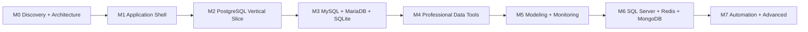

# Milestone Roadmap

Status: Sequenced planning baseline; estimates require team sizing after M0

Last updated: 2026-07-30

## 1. Delivery principles

- Complete one safe vertical slice before broadening engine or feature count.
- Milestones are evidence gates, not calendar promises. A later milestone cannot mask an unmet earlier safety/security/performance exit criterion.
- Spikes are disposable and never silently become production code.
- Unsupported/conditional adapter behavior remains unavailable rather than being emulated dangerously.
- Every milestone includes documentation, error/cancellation behavior, security, accessibility and measured performance—not a later “hardening phase”.

## 2. Milestone 0 — Discovery and architecture

**Goal:** Turn planning assumptions into evidence-backed decisions and remove critical unknowns before production development.

### Included scope

- Product specification, feature matrix, user flows, architecture, adapter contract, security threat model, database safety, tests, performance, distribution, roadmap/backlog/risks and ADRs.
- Original low-fidelity UX wireframes and accessibility annotations for shell, connection, editor/grid, production/destructive confirmation and transaction close (see [UX_WIREFRAMES.md](UX_WIREFRAMES.md)).
- Disposable spikes: Swift/Rust C ABI bounded stream/cancel/panic; PostgreSQL driver/TLS/cancel; SQL editor; virtualized grid; SSH/known-host/jump host; signed/notarized/update shell; local SQLite/Keychain boundary.
- Dependency/driver/editor/parser/grid/updater/SSH/license/advisory/binary-size and Apple Silicon evaluation.
- Supported macOS/architecture and direct-vs-Store distribution proposal.

### Excluded scope

- Production feature implementation, real user databases, production credentials, market launch, third-party plugins, permanent spike code.

### Dependencies

- Apple Developer account/test signing environment; disposable containers/ephemeral TLS/SSH services; representative Apple Silicon hardware; legal/privacy/security reviewers.

### Deliverables

- Accepted-for-planning ADR-0001–0007 plus M0 evidence ADRs and spike decision records with measurements/disposition.
- Architecture/module/FFI/capability/error/cancellation contracts.
- Threat-to-control-to-test traceability and prioritized risk register.
- Original low-fidelity UX wireframes and accessibility annotations reviewed against [UX_WIREFRAMES.md](UX_WIREFRAMES.md).
- Proposed exact dependency versions/checksums/licenses/advisories only after adoption review.

### Acceptance criteria

- C ABI spike proves ownership/version/panic/cancel/backpressure and bounded 1M-row fake stream.
- PostgreSQL spike proves valid/invalid TLS, typed streaming, transaction and cancellation truth against a disposable DB.
- Editor/grid prototypes meet provisional M0 budgets and accessibility checks or produce an accepted fallback decision.
- Empty arm64 Swift/Rust shell signs, notarizes, staples and rejects tampered/downgraded update.
- SSH spike records an adopt/reject disposition. Any retained candidate must
  fail closed for unknown/changed host keys, clean owned resources and pass the
  current advisory floor; otherwise SSH remains unavailable.
- No spike contains real credentials/data or is represented as a product feature.

### Test requirements

- ABI integration/sanitizer/leak/order/cancellation; hostile protocol lengths; TLS/SSH MITM; grid/editor performance/accessibility; signing/update tamper; secret canaries; spike cleanup.

### Security review

- Threat model workshop; dependency/license/SBOM prototype; Keychain access class; TLS/SSH/update key boundary; no sandbox decision compensating controls.

### Performance review

- Named M1 16 GB baseline; editor BF-01, grid BF-02/BF-03, FFI stream, shell launch/build/binary size.

### Exit criteria

- All Critical M0 unknowns have pass/fail evidence and owner; ADRs accepted or explicitly revised; failed spikes cause redesign/defer, not lowered safety; production implementation receives a separate request.

## 3. Milestone 1 — Application shell

**Goal:** Establish a buildable, testable native foundation with no database feature claims.

### Included scope

- Window/menu/sidebar/tab/inspector/bottom/status composition; command palette; settings; Light/Dark; keyboard/focus/accessibility baseline.
- Workspace/draft persistence and crash recovery; versioned SQLite migrations for non-sensitive metadata.
- Keychain abstraction and credential-reference model.
- Non-secret connection profile/domain validation (no real adapter connection yet).
- Structured redacted logging, typed error taxonomy, operation IDs, diagnostics preview/delete.
- Production/read-only visual language and generic operation/cancellation state components.
- Swift/Rust build, accepted C ABI version handshake/health fake stream and CI quality gates.

### Excluded scope

- Live database connections, SQL execution, editable grid, SSH production implementation, broad telemetry, background helper.

### Dependencies

- M0 ADR/spikes accepted; exact toolchains/dependencies approved; product identity/wireframes reviewed.

### Deliverables

- AppShell, Workspace, Connections domain, KeychainSecurity, Persistence, Diagnostics, SharedUI and TestSupport modules with explicit boundaries.
- CI for formatter/linter/build/unit/FFI/security/secret scanning; deterministic test fixtures.
- User-facing empty/loading/error/cancel states and help links.

### Acceptance criteria

- Launch/restore/multi-window/tab/keyboard/VoiceOver/appearance flows meet budgets.
- Keychain CRUD and locked/denied errors work with no plaintext fallback.
- Metadata migrations are transactional; canary secret absent from SQLite/UserDefaults/log/diagnostics/snapshots.
- FFI mismatch/panic/error/stream cancellation produces controlled state.
- Restored workspace never auto-connects or restores a transaction.

### Test requirements

- Swift unit/UI/accessibility/snapshot, persistence migration/recovery, Keychain security, FFI contract, diagnostics equality/redaction, launch/RSS.

### Security review

- Secrets/models/log schema, file permissions/bookmarks, entitlements/Hardened Runtime baseline, dependency inventory.

### Performance review

- Cold/warm launch, 20-tab restoration, idle RSS, migration/history and diagnostics retention.

### Exit criteria

- Clean arm64 build/test/lint/security gates pass; no live DB feature implied; architecture boundary review finds no UI-to-driver/secret persistence path.

## 4. Milestone 2 — PostgreSQL vertical slice

**Goal:** Deliver one coherent safe PostgreSQL workflow from connection through bounded results, keyed edit and CSV export.

### Included scope

- PostgreSQL profile/test/connect/disconnect; TLS/custom CA/client cert; an SSH
  tunnel subset only after separate adoption; bounded pool; read-only/
  production context.
- Lazy object explorer for databases/schemas/tables/columns/keys/indexes/views/materialized views/routines and DDL/details as capability permits.
- TextKit SQL tabs, current/selection/script execution, parser/classifier, timeout/row limit, typed streaming, messages/multiple results, cancel.
- Transactions/autocommit/commit/rollback and close/lost-state warnings.
- Virtualized typed grid, server cursor/paging strategy, type style baseline, safe key-based edits with preview/rollback/conflict.
- PostgreSQL explain baseline and streaming CSV export with formula/atomic/cancel controls.

### Excluded scope

- General object designer, schema/data diff, transfer/import, backup/restore, monitoring/user management, other engines.

### Dependencies

- M1 foundation; adopted PostgreSQL/TLS/parser dependencies; an adopted SSH
  dependency only if SSH is in scope; disposable PG matrix; M0 grid/editor/
  driver evidence.

### Deliverables

- PostgreSQL adapter/capability/version matrix and conformance suite.
- Query execution/result stream/transaction/edit/export services and end-to-end UI.
- User documentation for connection trust, production/destructive query and transaction behavior.

### Acceptance criteria

- All UF-02–UF-11/UF-17 scoped paths pass.
- R3 production/readonly controls cannot be bypassed by shortcut/stale preview/parser failure.
- One-million-row result stays within memory/frame budget and cancellation truth is accurate.
- Key edit changes exactly one row; zero/multiple/concurrent conflict and rollback are safe; no-key source is read-only.
- Bad certificate/hostname fails closed. If SSH is enabled, bad host keys fail
  closed and tunnel failure never uses a direct connection.
- CSV export is correct, formula-safe, bounded, cancellable and atomic/marked on failure.

### Test requirements

- PostgreSQL oldest/current disposable matrix and TLS/auth; add SSH tests only
  for an enabled SSH capability; classifier fuzz; transaction/cancel/loss;
  type round-trip; edit wrong-row regressions; UI/accessibility; performance/
  security.

### Security review

- Credential leases, TLS trust, conditional SSH trust, malicious server/result
  limits, SQL generation/injection, production/read-only/destructive
  safeguards and export path/formula.

### Performance review

- Connect, first object page, editor/completion, BF-02/BF-03 grid, 10M stream, CSV throughput/cancel, connection soak.

### Exit criteria

- PostgreSQL support claim matches passing matrix; all Critical safety/security/performance gates pass; exact limitations documented; no automatic write retry/commit.

## 5. Milestone 3 — MySQL, MariaDB and SQLite

**Goal:** Validate adapter/capability/normalized-type architecture across materially different engines without degrading PostgreSQL safety.

### Included scope

- MySQL, MariaDB and SQLite connection/explorer/query/transaction/cancel-as-supported/grid/keyed edit/CSV export vertical capabilities.
- Separate MySQL/MariaDB version/auth/dialect/type/metadata/implicit-commit matrices.
- SQLite user-selected file/read-only/write mode, busy/interrupt, attached DB, affinity/strict/WITHOUT ROWID and file-change handling.
- Cross-database connection/editor/grid UX and capability-specific unavailable states.

### Excluded scope

- SQL Server/Redis/MongoDB; professional diff/transfer/backup modules; pretending capability parity.

### Dependencies

- M2 contracts stable; each driver/license/TLS/auth adoption passes; disposable engine/file fixtures.

### Deliverables

- Three adapter implementations/conformance matrices; normalized type/dialect mapping tables; contract change ADR if required.
- Expanded UI capability snapshots and cross-engine documentation.

### Acceptance criteria

- UI never guesses support by engine name; conditional/unknown is correct.
- Query, transaction, cancel/session reuse, metadata, types and edits pass per declared matrix.
- MySQL `LOCAL INFILE` is off unless separately approved/one-operation scoped.
- MariaDB differences are tested and labeled; SQLite metadata DB cannot be opened as user target.
- All engines retain bounded result/memory and common safety behavior.

### Test requirements

- Oldest/current per engine, auth/TLS/charset/collation/storage engine, SQLite file/corruption/WAL, dialect snapshots, wrong-row and implicit-commit tests, UI capability/accessibility/performance.

### Security review

- Driver advisories/auth/TLS, malicious server/file, SQLite path/symlink, local infile, connection export and cross-engine SQL injection.

### Performance review

- Per-engine connect/metadata/stream/cancel/grid/export deltas and global multi-connection cache/pool memory.

### Exit criteria

- Adapter interface survives without unsafe common-denominator behavior; unsupported limitations explicit; all MVP engine gates pass.

## 6. Milestone 4 — Professional data tools

**Goal:** Add reviewed, cancellable, verifiable data/schema workflows on the proven adapter foundation.

### Included scope

- Object designer; expanded CSV/TSV/JSON/SQL/XML/XLSX import/export.
- Same/cross-engine transfer with explicit type mappings/checkpoints/error rows.
- Schema diff/sync and one-way data diff/sync with compare/preview/dry-run/review/apply/verify.
- Adapter-specific backup/restore where signed/licensed tools/APIs pass.

### Excluded scope

- Bidirectional sync without conflict model, unattended destructive automation, unsupported backup emulation, Parquet until later.

### Dependencies

- M3 adapters; diff/transfer/import/tool spikes; file/process security; large fixtures.

### Deliverables

- Designers/pipelines/planners/reports and adapter capability expansions.
- Mapping/transaction/checkpoint/partial-outcome contracts and user documentation.

### Acceptance criteria

- No compare/dry run can invoke apply; stale target/plan blocks.
- Generated SQL deterministic/previewed and dialect tested; destructive operations isolated/confirmed.
- Pipelines stay bounded, cancel and report committed/rolled-back/not-started state; resume avoids duplicates.
- Hostile files/paths/formulas/tools are contained; restore validates target/artifact and partial consequence.

### Test requirements

- Unit/property/fuzz, cross-engine disposable integration, rollback/partial/resume/drift, malicious files/process args, UI production/confirmation, BF-05/BF-06/throughput.

### Security review

- File/archive/XXE/formula/path/command/temp, tool/credential, diff target/production, type-loss and audit.

### Performance review

- 10 GB import/export, 100 GB transfer conditions, 50k-object diff, bounded RSS/checkpoints/cancel.

### Exit criteria

- Each format/engine/tool combination has passing capability evidence or is unavailable; no silent loss or false complete report.

## 7. Milestone 5 — Modeling and monitoring

**Goal:** Add physical modeling and safe operational visibility after core schema/data workflows stabilize.

### Included scope

- ER reverse engineering, physical model, nodes/edges/layout/manual positioning/minimap/search/groups/notes, PNG/PDF/SVG, compare/generate/apply through M4 safety.
- Explain plan visualization; active sessions/queries/locks/blockers/transactions/sizes; safe cancel/kill.
- Capability-aware user/role/privilege management.

### Excluded scope

- Conceptual/logical modeling/version collaboration, arbitrary server administration, background scheduling.

### Dependencies

- M4 metadata/diff/designer/safety, graph/layout/render spikes, monitoring/admin adapter ports.

### Deliverables

- Modeling module, plan renderer, monitoring/admin panels, capability/permission matrices.

### Acceptance criteria

- 500-table model meets interactive budget; 5,000 stress uses level of detail.
- Model-generated changes follow review/drift/R3 gates.
- Monitoring polling is bounded and cannot overload server; stale identity cannot kill/cancel.
- User/privilege preview and partial results are exact and secret-free.

### Test requirements

- Graph/layout/export/performance/accessibility, hostile plan, polling/permissions, kill/session consequence, role SQL/partial grants.

### Security review

- Admin privileges, denial-of-service polling, plan/metadata untrusted rendering, export content, destructive session/user actions.

### Performance review

- BF-05 layout/render/export; multi-hour monitoring polling/connection/resource soak.

### Exit criteria

- Model/monitor/admin claims match capability tests and performance; all dangerous actions show target/permission/consequence.

## 8. Milestone 6 — Additional engines

**Goal:** Add SQL Server, Redis and MongoDB through model-appropriate adapters and experiences.

### Included scope

- SQL Server relational vertical capabilities, authentication subset proven on macOS.
- Redis keyspace/command/cluster-aware bounded scanning and type-specific viewer/editor.
- MongoDB database/collection/index/validator/BSON/cursor/aggregation model and safe edits.

### Excluded scope

- Oracle/Phase-3 cloud engines, forced relational UX for non-relational engines, unsupported enterprise auth.

### Dependencies

- M3 adapter contract and M4/M5 reusable tools; driver/auth/license/legal spikes; disposable topology fixtures.

### Deliverables

- Three distinct adapter/capability/version/auth matrices and model-specific UI/workflows.

### Acceptance criteria

- Driver/auth/TLS/cancel/transaction/type/metadata/security matrices pass for every advertised capability.
- Redis scanning never blocks server or uses unbounded key load; dangerous commands classified.
- MongoDB cursor/BSON/topology/transaction semantics are preserved.
- SQL Server unavailable auth modes are stated, not silently downgraded.

### Test requirements

- Per-engine topology/version/auth/TLS/cancel/type/security, capability UI, malicious server and performance fixtures.

### Security review

- Cloud/AD auth tokens, ACL/users, cluster/SRV/TLS, non-relational injection/command classification, dependency/legal.

### Performance review

- Large keyspace/cursor/document, wide SQL Server results, metadata and model-specific editing.

### Exit criteria

- Each engine has a truthful supported matrix, original UX and no common-model safety regression.

## 9. Milestone 7 — Automation and advanced features

**Goal:** Add reviewed, bounded automation and enterprise policy without weakening interactive safety.

### Included scope

- Job engine for supported query/import/export/backup/transfer/comparison; schedules, manual run, checkpoints, notifications, logs/failure reports.
- App-open execution first; signed consented `SMAppService` LaunchAgent/XPC only after spike.
- Enterprise policy/approval/retention hooks, advanced modeling and carefully selected deferred formats such as Parquet.

### Excluded scope

- Production R3 scheduled jobs initially; claims of reliable logout/sleep execution; in-process arbitrary plugins; bidirectional sync absent approved conflict ADR.

### Dependencies

- Stable M4 operations, Keychain/helper/distribution threat review, idempotency/checkpoint design, notification/privacy policy.

### Deliverables

- Versioned job definition/state machine, bounded scheduler/worker, helper protocol/status, audit/notification UX and operations guide.

### Acceptance criteria

- Changed definition/target/capability/credential blocks run; no plaintext fallback.
- Overlap, retry/idempotency, cancel/checkpoint/partial/unknown states are exact.
- Helper signed/updated/rolled back with main app and user can disable it.
- UI truthfully states logout/sleep/Keychain/tunnel limitations.

### Test requirements

- State/property/crash/restart/duplicate/overlap/cancel/partial, helper/XPC/signature/update/Keychain, long soak and production policy tests.

### Security review

- Unattended credentials, stale target, privilege, helper/update/XPC authentication, notifications/log privacy, emergency disable.

### Performance review

- Worker/queue/connections/memory limits, helper idle/active footprint, concurrent job throughput and 8-hour soak.

### Exit criteria

- No unreviewed destructive automation; operations team can reconcile every outcome; helper/security/privacy/release gates pass.

## 10. Cross-milestone dependency gates

| Gate | Must be true before downstream scope |
| --- | --- |
| Architecture | ADR/spike evidence, boundary tests and no unresolved Critical design conflict |
| Database safety | Classifier/read-only/production/transaction/row identity/preview tests pass |
| Credential/trust | Keychain/TLS/secret-leak gates pass before direct connection; every shipped SSH capability must separately pass ADR-0012 re-entry gates |
| Adapter capability | Truthful supported/conditional/unknown snapshot and conformance matrix |
| Streaming/performance | Named fixture shows bounded memory/queue/cache/cancel and UI responsiveness |
| Distribution | Signed/notarized/update-tamper evidence before external beta |
| Documentation | User consequence, limits, untested/risk and runbook are current |

## 11. Technical spike backlog

| ID | Hypothesis | Scope | Success criteria | Disposal |
| --- | --- | --- | --- | --- |
| M0-S01 | C ABI can safely stream/cancel with bounded memory | Fake Rust adapter + Swift consumer only | 1M rows bounded; panic/ABI/ownership/cancel tests pass | Delete prototype; retain report/contract |
| M0-S02 | PostgreSQL candidate meets TLS/stream/cancel/transaction needs | Disposable PG only | Valid/invalid trust, typed stream, cancellation truth, rollback | Delete prototype; retain dependency decision |
| M0-S03 | TextKit 2 supports large SQL | Standalone editor prototype | BF-01 latency/RSS/keyboard/VoiceOver budgets | Delete; implement reviewed editor later |
| M0-S04 | `NSTableView` supports typed/wide virtual grid | Generated data only | BF-02/03 scroll/RSS/frozen/theme/edit/accessibility | Delete; select component design |
| M0-S05 | SSH candidate safely supports required tunnel modes | Ephemeral SSH/jump host | Known/unknown/changed key, agent/key/password subset, cancel/cleanup | Delete; adopt/reject candidate |
| M0-S06 | Direct artifact/update chain is viable | Empty app/core/helper | Sign/notarize/staple/tamper/downgrade/rollback | Delete/regenerate approved scaffold |
| M0-S07 | SQLite/Keychain separation is reliable | Synthetic profile/workspace | Transactional migration, denial/locked, canary absence | Delete; retain schema/security decision |

M0-S02 now has a complete runtime/dependency evidence record: the exact
PostgreSQL candidate is deferred by ADR-0009 because its upstream
frame and request-resource boundaries do not yet meet the product safety
contract. The spike source is disposable and is removed after the durable
report is committed.

M0-S03 now has a durable editor evidence record and ADR-0010 disposition.
TextKit 2 is conditionally retained as the planning candidate, while production
implementation remains gated on true input-to-frame measurement at the
M1/16 GiB floor, an editor RSS ceiling, real shortcut/VoiceOver behavior,
durable recovery and signposted cancellation. The proxy and metadata smoke
results are not treated as a full BF-01 or accessibility pass.
The disposable M0-S03 source was removed in commit `262250a`; its evidence
source remains auditable at `130bd3a`.

M0-S04 now has a durable grid evidence record and ADR-0011 disposition. The
full-grid `NSTableView` plus frozen-table candidate is rejected: BF-03 expands
the physical column/view graph and the split projection does not expose one
logical accessibility table. A bounded custom native two-dimensional renderer
is selected for subsequent planning, with production still gated on true
presented frames, M1/16 GiB memory, row-and-column object caps, unified
accessibility, manual VoiceOver and soak. The proxy values are not treated as
FPS or a presentation-budget pass. The disposable source was removed in commit
`c775b8e`; the exact evidence source remains auditable at `7acdec0`.

M0-S05 now has a durable SSH evidence record and ADR-0012 disposition. No
candidate is adopted: the tested system OpenSSH/native `-J` and exact
`ssh2`/libssh2 candidate are rejected, while exact `russh 0.62.4` is retained
only conditionally with seven frozen rows still unsupported. Production SSH
remains disabled; direct PostgreSQL/TLS planning does not depend on enabling
SSH. The exact disposable source is auditable at `875dd46` and was removed in
separate disposal commit `0b80f7e`.

M0-S06 now has a durable distribution evidence record and ADR-0013
disposition. The direct Developer ID channel remains the planning baseline,
but the release gate is closed: the host had no valid signing identity or full
Xcode, so notarization, stapling and clean-Mac Gatekeeper did not run. Exact
Sparkle `2.9.4` is conditional only; offline Ed25519/tamper and policy-model
smokes do not establish framework integration, install, rollback or key
rotation. The disposable source remains auditable at `f0457dd` and was removed
in separate disposal commit `38c7441`.

M0-S07 now has a durable persistence/credential evidence record and ADR-0014
disposition. Exact GRDB `7.11.1` conditionally remains the metadata candidate:
transactional migration/rollback, future-version refusal, crash/corruption,
bounded concurrency, retention, backup, permissions and canary-negative
surfaces passed. Actual Data Protection Keychain CRUD/attributes and XCTest
were unavailable because the host had no signed entitlement or full Xcode;
they remain unsupported rather than inferred from injected policy tests. No
production persistence or journal mode is enabled. The exact source is
auditable at `6388860`; disposal is recorded separately.

### Canonical M0 traceability

The IDs below prevent the spike list, backlog and architecture section from
drifting. `M0-S01`–`M0-S07` are disposable technical spikes; the dependency
dossier and wireframe review are milestone gates, not additional runtime
spikes.

| Roadmap spike/gate | Backlog item | Architecture evidence |
| --- | --- | --- |
| M0-S01 C ABI stream | DF-M0-001 | C ABI stream row |
| M0-S02 PostgreSQL driver | DF-M0-002 | PostgreSQL driver row |
| M0-S03 SQL editor | DF-M0-003 | SQL editor row |
| M0-S04 result grid | DF-M0-004 | Grid row |
| M0-S05 SSH tunnel/host trust | DF-M0-005 | SSH tunnel/host-trust row |
| M0-S06 distribution | DF-M0-006 | Distribution row |
| M0-S07 SQLite/Keychain | DF-M0-007 | SQLite/Keychain row |
| M0 dependency gate | DF-M0-008 | Dependency/adoption gate |
| M0 wireframe/accessibility gate | DF-M0-009 | UX wireframe artifact |

## 12. Recommended next planning task

**Only one next task:** execute `DF-M0-008 — dependency and license adoption
dossiers`. Consolidate exact source/version/checksum, license/notices,
advisories, maintenance, transitives, Apple Silicon/toolchain/size evidence,
replacement cost and adopt/defer/reject ownership for every candidate retained
by DF-M0-002–007. This is an assurance/planning gate, not permission to add a
production dependency.
