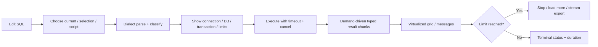

# User Flows

Status: Planning baseline

Last updated: 2026-08-01

## 1. Interaction principles

- The active connection, database/schema, environment, read-only state and transaction state remain visible for any operation that can reach a database.
- Loading, empty, error, cancelling, cancelled, partial and unknown-outcome states are designed explicitly.
- Keyboard and VoiceOver paths reach every critical action; production/destructive warnings never rely on red color alone.
- A preview is immutable and bound to a digest. Changing target, SQL, mapping, capability or transaction invalidates it.
- Compare, preview and apply are separate user intents. Cancel never means “server definitely stopped” without evidence.
- Error text describes consequence and next action; it never exposes a secret or raw stack trace.

The conditional [DF-M0-009 wireframe review](reports/DF-M0-009-wireframe-accessibility-review.md)
maps WF-01/02/03/04/05 to UF-01/02/03/04/05/06/09/12, including every required
review trace UF-01/02/04/05/06. It sharpens the planning focus, capability,
cancellation, limit and warning contracts but does not establish an executable
keyboard, VoiceOver, appearance or layout pass.

## 2. Global workspace flow

### UF-01 — First launch and workspace restoration

**Entry:** Fresh install or app reopen.

**Primary flow:**

1. Verify local metadata migrations before presenting a writable workspace.
2. Show an empty state with “New connection”, “Open database file”, and “Open SQL file”; no telemetry prompt blocks basic use.
3. Restore window geometry, panes and draft tabs incrementally.
4. Restored query tabs are disconnected and show their former non-secret connection reference; credentials are not fetched until the user reconnects.
5. Focus enters the primary actionable control and all actions are available through menu/command palette.

**Failure/cancel:** Migration failure opens a read-only recovery/export-drafts mode with actionable diagnostics. A missing file bookmark or connection shows repair/remove choices. No live transaction or query auto-runs.

**Acceptance:** Cold/warm launch budget, VoiceOver/focus order, no outbound telemetry on fresh install, no secret in restored state.

## 3. Connection flows

### UF-02 — Create and test a connection

**Entry:** New connection command.

**Primary flow:**

1. Choose adapter; the form renders only declared configuration/auth capabilities.
2. Enter non-secret endpoint/database/options, environment and optional read-only policy.
3. Choose database authentication method separately from credential storage.
   Enter secret fields; with Keychain storage off, use the bounded
   owner/deadline/revocation/best-effort-cleanup contract in WF-02. The secret
   never enters profile drafts, diagnostics, history or logs.
4. Configure TLS (validation on) and optional custom CA/client identity. Show
   SSH/jump-host/known-host controls only after an SSH capability is adopted;
   ADR-0012/0015 currently keep them unavailable.
5. “Test” validates form, acquires one credential lease for that attempt and establishes
   only configured transport/session layers with timeout/cancel, then closes
   everything. The current direct mode establishes TLS/database only; a tunnel
   exists only after an SSH implementation is adopted and configured.
6. Result states exactly which configured layers succeeded without exposing
   internals. Current direct mode reports TLS, database authentication and
   selected database, with no SSH or host-key phase.
7. Save non-secret metadata to SQLite. Save a secret to Keychain only after an
   explicit storage choice and successful Keychain operation; otherwise the
   profile has no persisted credential and prompts later. Partial save rolls
   back/reconciles.

**Failure/cancel:** Bad certificate/hostname blocks with repair options;
changed host key and tunnel/no-direct-fallback behavior exist only for a future
adopted and configured SSH capability. Locked/denied Keychain never saves
plaintext; cancel closes every configured socket/tunnel resource.

One `ConnectionAttempt` actor serializes lease/authentication/session/cancel/
close/error callbacks by attempt ID. An accepted cancel records `requested`,
revokes the lease, publishes `Cancelling`, then forwards driver cancel/close.
If success linearizes first, it remains success and a later cancel cannot
rewrite it. If cancel wins, late success cannot publish Connected and its
session is closed. Explicit driver acknowledgement alone yields `confirmed`
and permits `Cancelled`; close-before-confirmation yields `connectionClosed` +
unknown outcome, a typed terminal error remains Failed, `unsupported` fails/
closes without reusing or reacquiring that lease, and teardown deadline remains
unconfirmed/timeout. Repeated cancel is idempotent, stale callbacks are ignored,
and no event after revocation may read the secret.

**Production:** Environment selection requires confirmation and creates persistent text/icon badge; color is supplementary.

**Acceptance:** TLS/Keychain adversarial suite, no exported/logged secret,
keyboard flow and connection timeout/cancel; fake-clock permutations cover
revoke-before-announcement, auth/cancel ordering, late-session close,
connectionClosed/error-before-confirmation, repeated cancel, stale callback,
teardown deadline and denied use after revoke. Add the complete SSH suite only
when that capability is adopted and enabled.

### UF-03 — Connect, reconnect and disconnect

1. Select profile and connect; a cancellable state reports only configured
   phases. Current direct mode reports TLS/database authentication; SSH appears
   only after adoption and per-profile configuration.
2. On success, display server/database/read-only/production context before lazy metadata fetch.
3. On idle connection loss, offer reconnect. On transaction/write loss, report unknown outcome and do not auto-retry/resume.
4. Disconnect checks active transaction, pending edits, running operations and tunnel state.
5. The user can cancel disconnect, explicitly roll back where still possible, or close with a stated unknown/partial consequence.

No path auto-commits. Pool/tunnel sessions close cleanly; failure leaves a visible diagnostic ID.

## 4. Query flows

### UF-04 — Write and execute a normal query

**Primary flow:** Editor preserves draft; Execute resolves exact statement bytes, revalidates connection/capability/transaction, classifies safety, then starts. Result schema and bounded chunks populate the grid; multiple result/message panels stay ordered. Row limit stops fetch or asks explicit load-more/export.

**Failure:** Syntax error highlights position when trustworthy; network loss states whether a transaction/write outcome is unknown; unsupported explain or multi-result is disabled before execution.

**Cancel:** `Cancel Query` changes UI to `cancelling` immediately and propagates
to the driver. Cancellation outcome is one of `requested`, `confirmed`,
`connectionClosed` or `unsupported`; execution outcome is separate. Only
`confirmed` permits a `cancelled` execution result. `connectionClosed` reports
execution outcome unknown unless stronger adapter evidence exists. It does not
auto-retry.

### UF-05 — Execute destructive SQL on production

1. Parser identifies R3 effects (`DROP`, `TRUNCATE`, unconditional write or adapter equivalent) and all affected statements/objects.
2. Preview shows production target, database/schema, transaction/implicit-commit behavior, generated/exact SQL and optional safe impact estimate with method/time.
3. The Apply action remains disabled until the user types a stable target token (not a generic word).
4. Immediately before execution, core rechecks SQL bytes, target/session, capability, read-only/production and preview digest.
5. Execute records a redacted local audit and returns exact affected/partial/unknown outcome.

**Blocked states:** Parser uncertainty in production, stale preview, read-only profile, unknown capability or unsupported transactional expectation. There is no “ignore all safety” button. Keyboard shortcuts enter the same flow.

### UF-06 — Transaction lifecycle and close protection

1. User selects autocommit mode or explicitly begins a transaction; status bar announces transaction ID/state.
2. Statements run on the pinned session.
3. Commit/Rollback shows target and is disabled if state does not permit it.
4. Closing a tab/window/connection while active/failed/unknown opens a consequence-focused dialog: keep open, roll back (when possible), or close/disconnect acknowledging unknown outcome.
5. App termination aggregates affected tabs without hiding per-transaction target.

Commit is never a close default. Lost connections cannot be declared rolled back without adapter evidence.

### UF-07 — Explain and Explain Analyze

- `EXPLAIN` is generated only when supported and previewed.
- `EXPLAIN ANALYZE` is classified using the underlying statement because it may execute/modify data; production/write safeguards still apply.
- Raw adapter plan remains available; visual rendering is untrusted input and bounded.
- Unsupported plan formats show text/raw plan rather than fabricated visualization.

## 5. Explorer and grid flows

### UF-08 — Browse and search objects

1. Expand a node to request only its children; progress is local to that node and cancellable.
2. Limited permissions appear as a typed error/partial scope rather than an empty “no objects” claim.
3. Refresh invalidates that scope and preserves unrelated tree expansion.
4. Search uses the bounded cached index and offers explicit deeper/server search where supported.
5. Copy qualified name uses adapter quoting; opening object is keyboard accessible.

### UF-09 — View a large result/table

1. Query/table view receives typed schema and the first bounded page.
2. Grid differentiates not-loaded, `NULL`, empty string and empty binary.
3. Scrolling requests pages with backpressure; cache eviction does not discard pending edits or selection identity.
4. Large BLOB/text shows length/type/deferred indicator; load/view/export is explicit.
5. Sort/filter executes server-side or clearly labels local limited-scope behavior; changing it warns about pending edits.

### UF-10 — Edit a safely identified row

1. Adapter supplies a primary/proven unique `RowIdentityPlan`; otherwise see UF-11.
2. User edits typed values; pending cells use icon/style/text and remain local through scroll/theme change.
3. Apply preview lists target, key predicate, changed fields and optimistic-concurrency predicate; SQL uses parameters.
4. User confirms; application rechecks target/key/capability/preview and applies under explicit transaction policy.
5. Exactly one affected row succeeds and returned/refetched values reconcile. Zero becomes a conflict; more than one is a critical failure and rolls back where possible.
6. Failure preserves pending edits unless the user explicitly discards/rebases.

**Tests:** concurrent server update, key edit, nullable unique case, trigger/generated field, constraint failure, cancellation, rollback and connection loss.

### UF-11 — Table without safe row identity

The grid is read-only and shows an icon/text explanation: no primary/proven unique key means DataForge cannot guarantee the target row. Filtering, copy and export remain available. No “edit anyway by row position” shortcut exists in the planned product.

### UF-12 — Change data-type appearance

1. Open Settings or grid appearance inspector and choose scope: app, connection, database or grid/table.
2. Select enabled state/preset or customize text/background/font style for normalized type and semantic traits.
3. Live preview shows Light/Dark and non-color icon/tooltip behavior; contrast service warns/blocks unusable combinations according to policy.
4. Save preference in metadata (not credential record), invalidate style cache and update only visible cells.
5. Reset removes the selected override and reveals inherited palette.

Selection, scroll, loaded pages and pending edits remain unchanged. Increase Contrast/Differentiate Without Color/Reduce Motion changes are honored.

## 6. Design, diff and transfer flows

### UF-13 — Design or alter an object

1. Open capability-specific form from object explorer.
2. Edit desired state with validation and engine-specific options.
3. Generate deterministic migration preview with target, SQL, dependency order, lock/rewrite/destructive/transaction notes.
4. Save draft or explicitly apply through R2/R3 safety flow; closing with unsaved changes warns.
5. After execution, refresh/verify the object and report partial outcome.

No form edit calls the driver and no dangerous change auto-applies.

### UF-14 — Schema comparison and synchronization

```mermaid
flowchart LR
  Choose["Choose immutable source + target"] --> Inspect["Lazy introspection"]
  Inspect --> Compare["Normalize + compare"]
  Compare --> Map["Review adds/removes/changes/rename proposals"]
  Map --> Plan["Generate ordered migration"]
  Plan --> Dry["Preflight / dry run"]
  Dry --> Review["Review destructive/transaction/backup summary"]
  Review --> Confirm["Target-specific confirmation"]
  Confirm --> Recheck["Recheck target drift + digest"]
  Recheck --> Apply["Apply"]
  Apply --> Verify["Verify + exact report"]
```

Compare never invokes Apply. Changing include/exclude/rename mapping regenerates the digest. Ambiguous rename is not silently accepted. Drift, permission change or capability change after preview blocks apply.

### UF-15 — Data diff/sync and transfer

1. Select source/target and direction; production target is explicit.
2. Map tables/columns/types and choose a proven key; lossy conversions are highlighted with non-color text/icon.
3. Configure filter, batch/transaction/checkpoint and deletion policy.
4. Dry run streams counts plus bounded samples and operation summary.
5. Review/confirm; execute with progress/cancel and no blind write retry.
6. Verify and report committed/rolled-back/not-started batches and error rows.
7. Resume only if checkpoint/source/target/definition digest still matches.

Bidirectional sync is unavailable until a conflict ADR exists.

## 7. File flows

### UF-16 — Import untrusted data

1. User selects a file through the platform picker; path/bookmark is validated.
2. Format parser enforces size/row/field/nesting/decompression/path limits and creates a bounded preview.
3. User reviews encoding, delimiter/header, type/null/date mapping, target, error and transaction policy.
4. Dry validation reports issues without database writes.
5. Apply uses parameterized batches and explicit transaction/checkpoint; progress and cancel are visible.
6. Completion reports inserted/failed/rolled-back/partial rows and offers a redacted error-row file.

XXE/network resolution, archive traversal, symlink escape and spreadsheet formulas cannot execute. Inference remains reviewable.

### UF-17 — Export data

1. Choose page/all/selected rows/columns and format/options.
2. Show target file, overwrite state, estimated/unknown size, production/large-export warning and formula policy.
3. Stream through bounded encoder to a restricted temporary/atomic destination.
4. Cancel/delete or mark incomplete artifact according to format policy.
5. Verify final write, then reveal destination.

Secrets and hidden credential metadata are never included. Disk-full/permission failures preserve the source/result and explain partial file cleanup.

### UF-18 — Backup and restore

**Backup:** Select adapter-supported method/destination/options → validate signed/compatible tool and permissions → preview target/credential channel/retention → execute with progress/cancel → verify artifact/report.

**Restore:** Select artifact → validate format/tool/version → choose explicit target/environment → show destructive/backup/transaction/partial consequence → typed target confirmation → execute → verify target/report.

**Failure:** Tool missing/unsigned, secret-only-on-command-line method or unsupported sandbox combination is blocked. Cancellation never claims a partially restored database is usable.

## 8. Administration and automation flows

### UF-19 — Monitor, cancel query or kill session

1. Fetch bounded/rate-limited session/lock/query view by capability and permission.
2. Select a stable session/query identity; stale data requires refresh.
3. Cancel/kill preview states server/user/database, privilege and rollback/user-impact consequence.
4. Confirm and execute once; no automatic retry.
5. Refresh and report requested/confirmed/unknown outcome with audit ID.

### UF-20 — Manage user/role privileges

1. Read current capability/privilege state.
2. Edit desired memberships/privileges; secret creation fields use Keychain-safe flow.
3. Generate deterministic SQL/operation diff.
4. Review production/R2/R3 consequences and confirm.
5. Execute with partial-grant report and refresh verification.

### UF-21 — Create and run a job

1. Configure an operation already supported interactively; persist immutable versioned definition and non-secret connection reference.
2. Review target, risk, credential policy, schedule, timeout, overlap, retry/idempotency and notification.
3. MVP/early scope runs while app is open. Future helper registration requires explicit consent/status.
4. At run time revalidate definition/target/capabilities/credentials; changed or unavailable state blocks.
5. Run with bounded workers, cancel/checkpoint and redacted log; report exact outcome.

The UI explicitly states that logout/sleep may prevent a job. Initial automation does not schedule production R3 work.

## 9. Diagnostics and recovery flows

### UF-22 — Export diagnostics

1. Choose diagnostic time/operation scope.
2. Build a redacted local preview with exact included fields/files and retention notice.
3. User searches/reviews and may deselect entries.
4. Export writes exactly the previewed bytes atomically; no automatic upload.
5. Crash upload and telemetry have separate opt-in controls and exact payload previews.
6. “Delete history and diagnostics” removes selected local data without deleting Keychain credentials unless separately requested.

### UF-23 — Recover after connection/write uncertainty

1. Stop automation/retry for the affected operation.
2. Show operation/target/transaction ID, last confirmed boundary and `outcome unknown` without guessing.
3. Offer adapter-specific read-only reconciliation queries/refresh, not automatic replay.
4. Preserve pending intent/audit digest and let the user choose discard/rebase/retry only after outcome is established.
5. Generate a redacted diagnostic bundle for support if requested.

## 10. Cross-flow accessibility acceptance

- All icon-only controls have labels and keyboard equivalents.
- Focus order follows visual/task order and returns sensibly after dialogs.
- Warnings state Production/Read-only/Transaction/Risk as text and VoiceOver announcements.
- Progress has operation name, target, value/indeterminate state and Cancel label.
- Grid/editor/tree expose native roles/selection/value; custom cells implement required accessibility protocols.
- Dynamic font/row settings, Light/Dark, Increase Contrast, Differentiate Without Color and Reduce Motion are tested.
- No timed confirmation or color-only validation is required to complete a safety flow.
